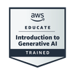

# Alexandre Rothier

Data Scientist | Cloud & AI Solutions

---

I build data-driven solutions using Python, SQL, and AWS. My work spans from ETL pipelines and data engineering to machine learning and generative AI applications.

## What I work with

Python • SQL • AWS • Machine Learning • Data Engineering

---

📫 [LinkedIn](https://linkedin.com/in/rothier) • alexandrerothier@gmail.com